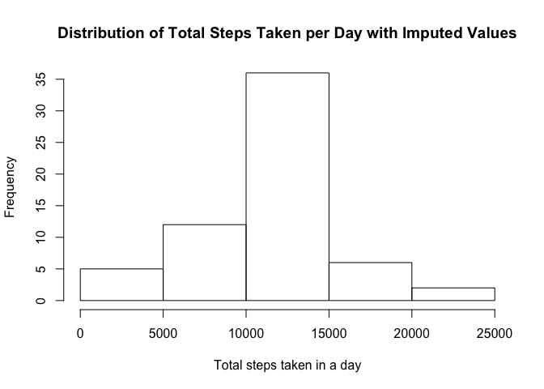

# Reproducible Research: Peer Assessment 1

## Loading and preprocessing the data

Unzip and read in assignment data. It is assumed that this script is in the same directory as the data. Briefly inspect the data.


```r
unzip("activity.zip")
activity<-read.csv("activity.csv")

head(activity)
```

```
##   steps       date interval
## 1    NA 2012-10-01        0
## 2    NA 2012-10-01        5
## 3    NA 2012-10-01       10
## 4    NA 2012-10-01       15
## 5    NA 2012-10-01       20
## 6    NA 2012-10-01       25
```

```r
summary(activity)
```

```
##      steps               date          interval   
##  Min.   :  0.0   2012-10-01:  288   Min.   :   0  
##  1st Qu.:  0.0   2012-10-02:  288   1st Qu.: 589  
##  Median :  0.0   2012-10-03:  288   Median :1178  
##  Mean   : 37.4   2012-10-04:  288   Mean   :1178  
##  3rd Qu.: 12.0   2012-10-05:  288   3rd Qu.:1766  
##  Max.   :806.0   2012-10-06:  288   Max.   :2355  
##  NA's   :2304    (Other)   :15840
```

## What is mean total number of steps taken per day?

Mean total number of steps=sum of all steps taken divided by number of days recorded. 


```r
totals<-as.data.frame(tapply(activity$steps, activity$date, sum))
colnames(totals)<-c("total")
totals$total<-as.numeric(totals$total)

hist(totals$total)
```

 


```r
mean_Steps<-sum(activity$steps, na.rm=TRUE)/length(levels(activity$date))
median_steps<-median(tapply(activity$steps, activity$date, sum, na.rm=TRUE), na.rm=TRUE)
```

The mean steps taken per day = **9354.2295** and the median steps taken = **10395.**

## What is the average daily activity pattern?

Create a time series plot of the average activity per time interval across the recorded period. Essentially average the data grouping by the interval column...
Commented lines overlay the the average +/- the standard deviation (blue lines) to assess the variation in activity for each interval across the recorded period


```r
interval_avg<-as.data.frame(tapply(activity$steps, activity$interval, mean, na.rm=TRUE))
colnames(interval_avg)<-c("average")
interval_avg$interval<-as.numeric(rownames(interval_avg))

plot(x=interval_avg$interval, y=interval_avg$average, type="l",xlab="interval", ylab="Average Activity per interval")
```

 

```r
#lines(y=interval_avg$average-tapply(activity$steps, activity$interval, sd, na.rm=TRUE), x=interval_avg$interval, col="blue")

#lines(y=interval_avg$average+tapply(activity$steps, activity$interval, sd, na.rm=TRUE), x=interval_avg$interval, col="blue")

maxInterval<-interval_avg[interval_avg$average==max(interval_avg$average),2]
```

The time interval with the highest average activity is **835**.

## Imputing missing values

Mean steps for each interval was used to impute missing values, encoded as NA. Using the ave f(x) we can calculate the average value for a subset of the data and assign it to the rows with missing values.


```r
imputed<-activity

missingBefore<-sum(is.na(activity$steps))

imputed[which(is.na(imputed$steps)),1]<-ave(imputed$steps, imputed$interval, FUN = function(x) mean(x, na.rm = TRUE))[c(which(is.na(imputed$steps)))]

missingAfter<-sum(is.na(imputed$steps))

hist(tapply(imputed$steps, as.factor(imputed$date), sum), main="Distribution of Total Steps Taken per Day with Imputed Values", xlab="Total steps taken in a day")
```

 

```r
meanImpute<-sum(imputed$steps, na.rm=TRUE)/length(levels(imputed$date))
medianImpute<-median(tapply(imputed$steps, imputed$date, sum, na.rm=TRUE), na.rm=TRUE)
```

The number of missing values is **2304**. The mean number of steps taken per day after imutation = **1.0766 &times; 10<sup>4</sup>**. The median number of steps taken per day after imputation = **1.0766 &times; 10<sup>4</sup>**.

Imputing the missing data increased both the mean and the median steps taken per day. 

## Are there differences in activity patterns between weekdays and weekends?

First, create a new factor variable "weekday" and "weekend". Then plot the average steps taken per interval for the weekdays and weekends, separately.


```r
library(ggplot2)

imputed$Day<-weekdays(as.Date(imputed$date))
imputed[(imputed$Day=="Sunday"|imputed$Day=="Saturday"), 4]<-c("Weekend")
imputed[(imputed$Day !="Weekend"), 4]<-c("Weekday")

imputedAgg<-aggregate(steps ~ interval + Day, data=imputed, mean)

qplot(interval, steps, data=imputedAgg, facets=Day~., geom = c("line", "line"))
```

 
